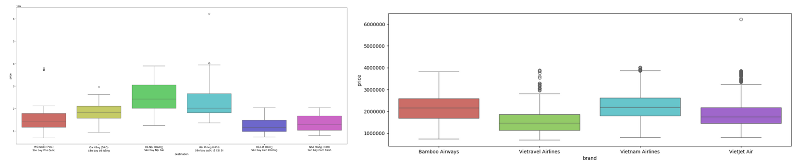
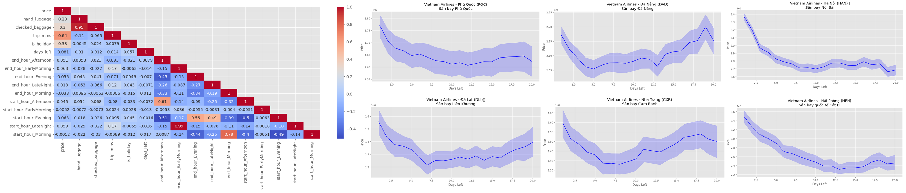
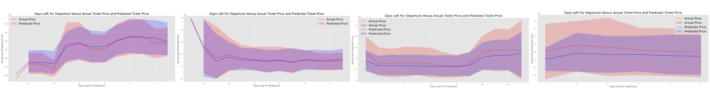
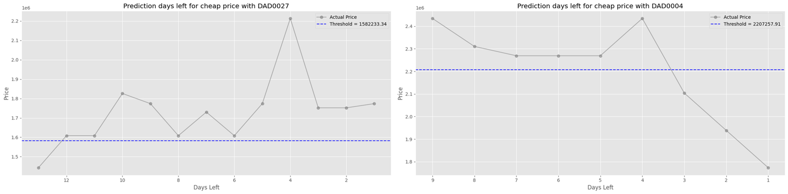

_Đồ án môn học DS108 - Thu thập và tiền xử lý dữ liệu_
# AIRSCIENCE: Phân Tích Dữ Liệu Ngành Hàng Không

## Mục lục
_Đồ án môn học DS108 - Thu thập và tiền xử lý dữ liệu_

# AIRSCIENCE: Phân Tích Dữ Liệu Ngành Hàng Không

## Mục lục
- [1. Tổng Quan](#1-tổng-quan)
- [2. Tính Năng](#2-tính-năng)
- [3. Bộ Dữ Liệu](#2-bộ-dữ-liệu)
- [4. Cấu Trúc Dự Án](#4-cấu-trúc-dự-án)
- [5. Thực Thi](#4-thực-thi)
- [6. Tài Liệu Liên Quan](#5-tài-liệu-liên-quan)
- [7. Thành Viên](#6-thành-viên)

## 1. Tổng Quan
Nhóm nghiên cứu đã tiến hành thu thập và phân tích dữ liệu vé máy bay, sau đó ứng dụng các kỹ thuật học máy để xây dựng một hệ thống dự đoán giá vé theo thời gian. Mục tiêu của hệ thống này là đưa ra khuyến nghị về thời điểm mua vé tối ưu, nhằm hỗ trợ khách hàng đưa ra quyết định thông minh và tiết kiệm chi phí.

## 2. Tính Năng
- Phân tích dữ liệu thông qua khai phá mối quan hệ giữa giá vé với các thuộc tính khác để đưa ra những quy luật ẩn
- Sử dụng các mô hình học máy, đưa ra khuyến nghị về thời điểm đặt vé tối ưu nhất cho chuyến bay
- Dữ liệu đầu vào là các thuộc tính cơ bản của một vé máy bay và đầu ra sẽ là giá vé dự đoán để đưa ra được thời điểm đặt vé hợp lý và khuyến nghị nên mua hay chờ.
- Website demo đưa khuyến nghị hỗ trợ người dùng chọn đúng thời điểm đặt vé với chi phí, ngân sách phù hợp ở thị trường Việt Nam

## 3. Bộ Dữ Liệu

Dữ liệu được lưu theo cấu trúc phân tầng - Medallion Structure

### Bronze Layer 
Dữ liệu thô thu thập từ trang web Traveloka, bao gồm:
- `id` (do nhóm tự gán): id của chuyến bay với mỗi chuyến bay có tối thiểu 2 sample cho 2 ngày mua khác nhau
- `start_day`, `end_day`, `crawl_date`: `crawl_date` bắt đầu từ 07/04/2025 đến 10/05/2025 và trước 20 ngày so với `start_day`
- `destination`: 
    - Thành phố lớn: Hà Nội (HAN), Hải Phòng (HPH), Đà Nẵng (DAD)
    - Điểm đến du lịch: Phú Quốc (PQC), Nha Trang (CXR), Đà Lạt (DLI)
- `brand` (hãng hàng không sẽ dựa theo các chuyến bay đến các địa điểm định trước): Bamboo Airways, Vietnam Airlines, VietJet Air, Viettravel Airlines
- `price`, `start_time`, `end_time`,  `trip_time`, `checked_baggage`, `hand_luggage`

### Silver Layer
- Dữ liệu đã được làm sạch, xử lý giá trị thiếu, và chuẩn hóa định dạng.
- Kích cỡ: 46,549 mẫu với 11 thuộc tính.

    | Index | Feature           | Description                   | Type         |
    |-------|-------------------|-------------------------------|--------------|
    | 1     | `id`              | mã chuyến bay                 | categorical  |
    | 2     | `brand`           | hãng bay                      | categorical  |
    | 3     | `price`           | giá vé (VNĐ/khách)            | numeric      |
    | 4     | `destination`     | điểm đến                      | categorical  |
    | 5     | `hand_luggage`    | hành lý xách tay (kg)         | numeric      |
    | 6     | `checked_baggage` | hành lý ký gửi (kg)           | numeric      |
    | 7     | `start_hour`      | khung giờ khởi hành           | categorical  |
    | 8     | `end_hour`        | khung giờ hạ cánh             | categorical  |
    | 9     | `trip_mins`       | thời gian bay                 | numeric      |
    | 10    | `is_holidays`     | phân loại ngày bay            | categorical  |
    | 11    | `days_left`       | số ngày trước ngày bay       | numeric      |

### Gold Layer
Dữ liệu đã chuẩn hóa và phân loại theo từng hãng hàng không, sẵn sàng phân tích.

## 4. Cấu Trúc Dự Án
```bash
.
├── Data
│   ├── Bronze_layer/
│   │   └── merged_file.csv           
│   ├── Silver_layer/
│   │   └── cleaned_file.csv          
│   ├── Gold_layer/
│   │   ├── Bamboo_Airways.csv
│   │   ├── VietJet_Air.csv
│   │   ├── Vietnam_Airlines.csv
│   │   └── Vietravel_Airlines.csv   
│
├── 01_crawling.ipynb                
├── 02_preprocessing.ipynb           # Tiền xử lý dữ liệu: làm sạch, định dạng, xử lý thiếu
├── 03_EDA.ipynb                      # Phân tích dữ liệu khám phá (Exploratory Data Analysis)
├── 04_modeling.ipynb                 # Huấn luyện mô hình và đánh giá kết quả
├── 05_web_demo                       # Demo website tương tác với người dùng
├── README.md                         # File mô tả dự án
```
## 5. Thực Thi
### Thu thập dữ liệu:
- Sử dụng tool Selenium và kết hợp MicrosoftEdge website.
- Nhược điểm: chưa hoàn toàn tự động hóa do gặp chặn Captcha của Traveloka.

### Khai phá dữ liệu:
Từ kết quả EDA, nhóm cần cẩn trọng trong cách xử lý outliers. Đồng thời, nhóm quyết định chia dữ liệu theo hãng bay thay vì theo địa điểm đến hay các yếu tố khác. 
    
    

### Huấn luyện mô hình:
- Chia dữ liệu:
    - `Test_data`: 40 id
    - `Train + Test`:
        - `Test` = 18% * (dataset - Test_data) + Test_data
        - `Train` = dataset - Test
    - Xử lý outliers riêng cho từng file

- Huấn luyện mô hình (`Train + Test`):
    - Độ đo: `R2-Score`, `MAE`, `MAPE`
    - Mô hình: `AdaBoost`, `BaggingRegressor`, `GradientBoostingRegressor`, `DecisionTreeRegressor`, `RandomForestRegressor`, `ExtraTreesRegressor`
    - Mô hình lựa chọn: **Gradient Boosting Regressor** với xu hướng tăng giảm dự đoán của các hãng Bamboo Airways, VietNam Airlines, Vietjet Air, Viettravel Airlines khá sát với thực tế
    

- Thực nghiệm (`Test_data`):
    
    
    Để ứng dụng vào thực tiễn, nhóm sử dụng dữ liệu của 40 chuyến bay nhằm chọn ngưỡng mua vé phù hợp, từ đó đưa khuyến nghị Nên Mua (1) hay Nên Chờ (0).

    Quá trình tính ngưỡng:
    - Bước 1: Dự đoán giá vé chuyến bay các ngày tiếp theo bằng mô hình Gradient Boosting Regressor đã được huấn luyện:
        
        
        `P={p_1,p_2,p_3,…,p_n }`
    - Bước 2: Chọn 10% giá vé thấp nhất (k là số lượng vé):
        
        `P_low={p_1,p_2,p_3,…,p_k }`
    - Bước 3: Tính threshold là giá trị trung bình của Plow:
        
        
        `threshold=1/k ∑_(i=1)^k p_i` 


    Dựa vào kết quả của threshold hệ thống sẽ đưa ra khuyến nghị phù hợp:
    - Hình bên trái: Khi giá vé lớn hơn ngưỡng, mô hình sẽ khuyến nghị khách hàng nên chờ (label = 0). 
    - Hình bên phải: Khi giá vé bé hơn ngưỡng, khuyến nghị mô hình đưa ra là nên mua (label = 1).
    

### Chạy web thử nghiệm:


## 6. Tài Liệu Liên Quan
- Báo cáo chi tiết: [(paper.pdf)](paper.pdf)  
- Slide thuyết trình: [(slides.pdf)](slides.pdf)

## 7. Thành Viên
| Họ và tên              | MSSV       |
|------------------------|------------|
| Đinh Bảo Thy           | 23521563   |
| Võ Ngọc Anh Thy        | 23521565   |
| Nguyễn Vũ Thùy Trâm    | 23521617   |
